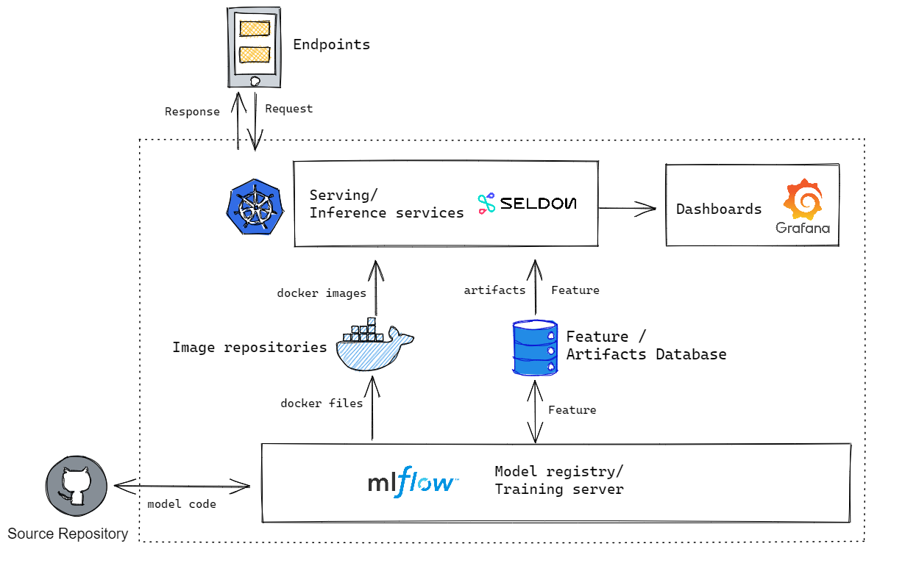

Repository for pf homework

```
pf-model
│   README.md - Setup guide
│
└───mlflowserver
│   │   MLFlowServerCustom.py - Logic code for a new custom seldon core server with pre-processing data function
│   │   requirement.txt - required libraries for custom seldon core server
└───deploy - yaml files for deploy model on k8s   
└───images
└───mlruns - trained model artifacts
└───model
│   └───data - raw, traning & vocab data
│   └───train.py - training model's code
│   └───train.ipynb - jupyter training model's notebook
└───environment - define environment of custom seldon server
└───requirement.txt - required libraries for training model
└───Makefile - Make custom seldon server docker
```

# I. Architecture

Simple architecture


More details


- Source Repository: A central repository. In this repo we can using both local or github

- MLFlow: Training components
    
    - Package ML model's code in a format to reproduce runs on any platform
    - Defines environment, parameters and model’s interface.
    - Track experiment results and hyperparameters
    - Snapshot / version of the model.
  
- Feature / Artifacts database: 
    - Training data, feature: local file in this example, its can be migrated to S3, GCS, Feature Store...  later. 
    - Artifacts database: artifacts of trained model.Note that in a production setting, MLflow would be configured to log models against a persistent data store (e.g. GCS, S3, Minio, etc.).

- Image repositories: Docker hub (on cloud can using GCP Image repositories/ AWS Container Registry)

- Seldon Core: Serving / Inference services

  *"Easier and faster to deploy your machine learning models and experiments at scale on Kubernetes"*

    - Preprocessing request: **There are 3 three ways to do preprocessing**
      - Within the model
      - Transform function
      - Feature Store

    - Dashboard: Model performance & other metrics

- Endpoints: post request & get result from Serving service by REST / GRPC

# II. Pre-requisites 🧰

## Anaconda

We're using Anaconda for easy manage develop environment

Details : https://docs.anaconda.com/anaconda/install/

Create new environment
```bash
!conda create --n podfoods python=3.7
```
## MLFlow

```bash
!pip install mlflow
```

## Seldon

- Seldon Core

Setup document on local / Cloud... details: https://docs.seldon.io/projects/seldon-core/en/latest/nav/installation.html

*Note: Seldon core is recommended install on GCP environment*

## s2i (Source to Image)

https://github.com/openshift/source-to-image#installation

We using s2i to build custom serving server later


# III. Training model

```bash
!mlflow run model -P max_depth=3 n_estimators=50 data_month=5
```
or
```bash
!python model/train.py 3 50 5
```

Interactive with jupyter notebook model/train_model.ipynb

# IV. Model exprimental management

```bash
!mlflow ui
```
http://localhost:5000


Test serve model at local

```bash
mlflow models serve -m C:\Users\haunv\Documents\GitHub\pf-model\mlruns\0\100ab95827c749d6803bb1093b36cd43\artifacts\model -p 1234
http://127.0.0.1:1234/invocations
{"data":[[0,0,0,0,0,28,4,0,0,0,1,0,0,0,1,0,0,0,0,0,0,0,0,0,0,0,0,0,0,0,0,0,0,0,0,0,0,0,0,1,0,0,0,1,0,0,0,0,0,0,0,0,0,0,0,0,0,0,0,0,0,0,0,0,0,0,0,0,0,0,0,0,0,0,0,0,0,0,0,0,0,0,0,0,0,0,0,0,0,0,0,0,0,0,0,0,0,0,0,0,0,0,0,0,0,0,0,0,0,0,0,0,0]]}
curl -d '{"columns":["x"], "data":[[1], [-1]]}' -H 'Content-Type: application/json; format=pandas-split' -X POST localhost:1234/invocations

```

# V. Build model docker image

```bash
!make
```

Test docker image locall

```bash
!docker run -it --rm -p 8080:8080 -e PREDICTIVE_UNIT_PARAMETERS='[{"type":"STRING","name":"model_uri","value":"file:///model"}]' -v /home/haunv_it/pod-toy-model/model:/model haunv/mlflowservercustom:latest
```

Push to docker hub (Edit corresponding to your docker hub repositories)

```bash
!docker push haunv/mlflowservercustom:latest
```

# VI. Deploy model docker image 

1. Edit seldon ML servers config values (MLFLOW_SERVER_CUSTOM)

```yaml
predictor_servers:
...
  TEMPO_SERVER:
    protocols:
      kfserving:
        defaultImageVersion: "0.3.2"
        image: seldonio/mlserver
  MLFLOW_SERVER_CUSTOM:
    protocols:
      seldon:
        defaultImageVersion: "1.15.0-dev"
        image: haunv/mlflowservercustom
    
```

2. Register custom ML server config with seldon core

```bash
!git clone seldon-core

!helm upgrade seldon-core seldon-core/helm-charts/seldon-core-operator --namespace seldon-system --values deploy/values.yaml --set istio.enabled=true
    
```

3. Upload Artifacts 

4. Deploy model to K8S 

YAML file

```yaml
apiVersion: machinelearning.seldon.io/v1alpha2
kind: SeldonDeployment
metadata:
  name: toy-model
  namespace: seldon
spec:
  name: toy-model
  predictors:
  - componentSpecs:
    - spec:
        # We are setting high failureThreshold as installing conda dependencies
        # can take long time and we want to avoid k8s killing the container prematurely
        containers:
        - name: regressor
          livenessProbe:
            initialDelaySeconds: 80
            failureThreshold: 200
            periodSeconds: 5
            successThreshold: 1
            httpGet:
              path: /health/ping
              port: http
              scheme: HTTP
          readinessProbe:
            initialDelaySeconds: 80
            failureThreshold: 200
            periodSeconds: 5
            successThreshold: 1
            httpGet:
              path: /health/ping
              port: http
              scheme: HTTP

    graph:
      children: []
      implementation: MLFLOW_SERVER_CUSTOM
      modelUri: gs://pod-seldon-model/pod-toy-model/model
      name: regressor
    name: default
    replicas: 1
```

Create K8S namespace

```bash
!kubectl create namespace seldon
```

```bash
!kubectl apply -f deploy/seldon-deploy-toy-model.yaml
```

check k8s status
```bash
kubectl get pods --all-namespaces
```

- Serving endpoint

> http://<ingress_url>/seldon/<namespace>/<model-name>/api/v1.0/predictions

  example: http://34.126.90.125/seldon/seldon/toy-model/api/v1.0/predictions

- Example Request predict for store id 2519 & product id 5273
```bash
curl -X POST "http://34.126.157.32/seldon/seldon/toy-model/api/v1.0/predictions" -H "accept: application/json" -H "Content-Type: application/json" -d "{\"data\":{\"names\":[\"store_id\",\"product_id\"],\"ndarray\":[[2519,5273]]}}"
```
- Example Response

model return prediction result is 14.56 for the next 30days

```json
{
  "data": {
    "names": [],
    "ndarray": [
      14.563408949535173
    ]
  },
  "meta": {
    "requestPath": {
      "regressor": "haunv/mlflowservercustom:latest"
    }
  }
}

```

- API document

http://34.126.157.32/seldon/seldon/toy-model/api/v1.0/predictions


# VII. Dashboard

1. Install Seldon Analytics
  
```bash
!kubectl config set-context $(kubectl config current-context) --namespace=seldon
```
```console
!helm install seldon-core-analytics seldon-core/helm-charts/seldon-core-analytics  \
        --set grafana_prom_admin_password=password \
        --set persistence.enabled=false \
        --namespace seldon-system \
        --wait

```
note: if get issue *unable to build kubernetes objects from release manifest*..., please downgrade K8S to version 1.21

Map grafana port to 3000

```bash
kubectl port-forward $(kubectl get pods -n seldon-system  -l app.kubernetes.io/name=grafana -o jsonpath='{.items[0].metadata.name}') 3000:3000 -n seldon-system
```
http://localhost:3000

or try with http://34.124.157.160:3000/d/U1cSDzyZz/prediction-analytics?orgId=1&refresh=5s


note: When deploy on GKE or AWS, we need to apply deploy/grafana-map-port.yaml LoadBalancer

# Delete, free resource

```bash
!kubectl delete -f deploy/seldon-deploy-toy-model.yaml
```
```bash
!kubectl delete -f deploy/grafana-map-port.yaml
```

# Additional

- Benchmark

Serving service's performance is considered to working stable on production

- Auto scaling

https://docs.seldon.io/projects/seldon-core/en/latest/graph/scaling.html

# Discusstion

??? Why we dont using Flask only?

- On the REAL production, depend on requiremnent some components are considered:

  - Expriment service: A/B testing
  - CI/CD components: Jenkin & JenkinX
  - Data drift detect: Alibi
  - Explain (model interpretation): Alibi